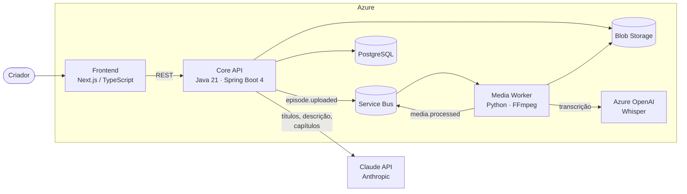

# lavra

> **Você grava. O resto é lavra.**

O **lavra** é um automatizador de pós-produção de podcasts. O criador entrega o áudio bruto e recebe de volta um episódio pronto para publicar: áudio limpo e normalizado, transcrição, títulos, descrição, capítulos e tags — tudo gerado por IA e aprovado por revisão humana antes de sair.

O nome vem de *lavra* (garimpo): extrair o valioso do bruto.

## Por que existe

Nasceu de uma dor real: o podcast [Expulsando Demônios](docs/specs/0001-pipeline-mvp.md) (filosofia, teologia, fenomenologia — com irreverência). Gravar é a parte boa; edição, cortes, artes, títulos e descrições são a parte que ninguém quer fazer. O lavra transforma esse fluxo manual com IA em um produto.

**Diferencial:** o lavra aprende a *voz* do criador. Títulos e descrições saem no estilo dele — não em texto genérico de IA — e nada é publicado sem aprovação humana.

## Arquitetura

Três serviços, cada um na linguagem em que o problema é melhor resolvido:



| Serviço | Stack | Responsabilidade |
|---|---|---|
| **Core API** | Java 21, Spring Boot 4, Gradle | Domínio, máquina de estados dos episódios, REST API, geração de conteúdo via Claude |
| **Media Worker** | Python 3.12, FastAPI | Limpeza/normalização de áudio (FFmpeg), transcrição (Whisper via Azure OpenAI) |
| **Frontend** | TypeScript, Next.js | Upload, acompanhamento do pipeline, tela de revisão e aprovação |

Infraestrutura: **Azure Container Apps** (escala a zero), **PostgreSQL Flexible Server**, **Blob Storage**, **Service Bus**, **Key Vault**, **Application Insights** (OpenTelemetry). Identidade via **Microsoft Entra External ID** (OIDC); planos e cotas (`FREE`/`CREATOR`/`STUDIO`, medidos em minutos processados/mês) aplicados pelo Core API — ver [spec 0004](docs/specs/0004-autenticacao-planos-entitlements.md).

Toda decisão de arquitetura está registrada em [ADRs](docs/adr/) — comece pelo [ADR-0001](docs/adr/0001-arquitetura-poliglota-tres-servicos.md).

## O pipeline

```
PENDING_UPLOAD → RECEIVED → AUDIO_PROCESSING → TRANSCRIBING → GENERATING → IN_REVIEW → READY
                                    └──────────────┴─────────────┴──► FAILED (com retry)
```

1. **Upload** — o criador sobe o áudio bruto pelo frontend, direto para o Blob Storage ([ADR-0011](docs/adr/0011-upload-direto-ao-blob-com-sas.md)).
2. **Limpeza** — o worker normaliza loudness (-16 LUFS), remove silêncios longos e reduz ruído.
3. **Transcrição** — Whisper (Azure OpenAI) transcreve com timestamps.
4. **Geração** — o Claude gera 3–5 opções de título, descrição, capítulos e tags a partir da transcrição, calibrado pela voz do criador.
5. **Revisão** — o criador aprova, edita ou regenera cada artefato.
6. **Export** — áudio final + textos prontos para publicar.

Detalhes em [docs/specs/](docs/specs/).

## Estrutura do repositório

```
lavra/
├── core-api/        # Java 21 + Spring Boot 4 (a criar)
├── media-worker/    # Python + FFmpeg (a criar)
├── frontend/        # Next.js + TypeScript (a criar)
├── contracts/       # Contratos: OpenAPI + JSON Schema dos eventos
├── docs/
│   ├── adr/         # Architecture Decision Records
│   └── specs/       # Especificações funcionais
├── infra/           # Docker Compose local + IaC (a criar)
├── scripts/         # Scripts de desenvolvimento
└── .claude/skills/  # Skills do Claude Code para o fluxo do projeto
```

## Rodando localmente

Pré-requisitos: Docker Desktop.

```powershell
# Sobe Postgres + Azurite (Blob) + emulador do Service Bus + emulador de OIDC
.\scripts\dev-up.ps1

# Derruba tudo
.\scripts\dev-down.ps1
```

Em Linux/macOS: `docker compose -f infra/docker-compose.dev.yml up -d`.

**Nenhuma conta Azure é necessária para rodar localmente.** A autenticação em desenvolvimento usa um emulador de OIDC no lugar do Entra ([ADR-0012](docs/adr/0012-autenticacao-no-desenvolvimento-local.md)): pegue um token em `http://localhost:8081/lavra/debugger` e troque de usuário na tela de login para exercitar posse e papéis.

Cada serviço terá seu próprio README com instruções de build e execução.

## Status

🚧 **Em construção.** Fase atual: fundação — arquitetura, contratos e especificações definidos; implementação dos serviços em andamento. Acompanhe o [spec do MVP](docs/specs/0001-pipeline-mvp.md).

## Documentação

- [ADRs — decisões de arquitetura](docs/adr/)
- [Specs — especificações funcionais](docs/specs/)
- [Contracts — eventos e API](contracts/)

## Licença

Este projeto é **source-available** sob a [PolyForm Noncommercial License 1.0.0](LICENSE.md): você pode clonar, rodar, estudar e modificar o código **para fins não comerciais**. Qualquer uso comercial — incluindo oferecer este software, ou derivados dele, como produto ou serviço — é proibido sem autorização por escrito do autor.

> Required Notice: Copyright (c) 2026 José Guilherme Costa Câmara (https://github.com/GuilhermePio1/lavra)
